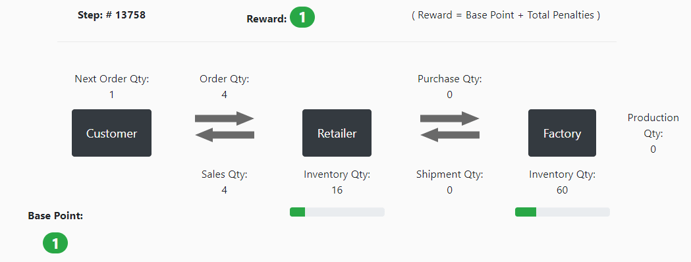
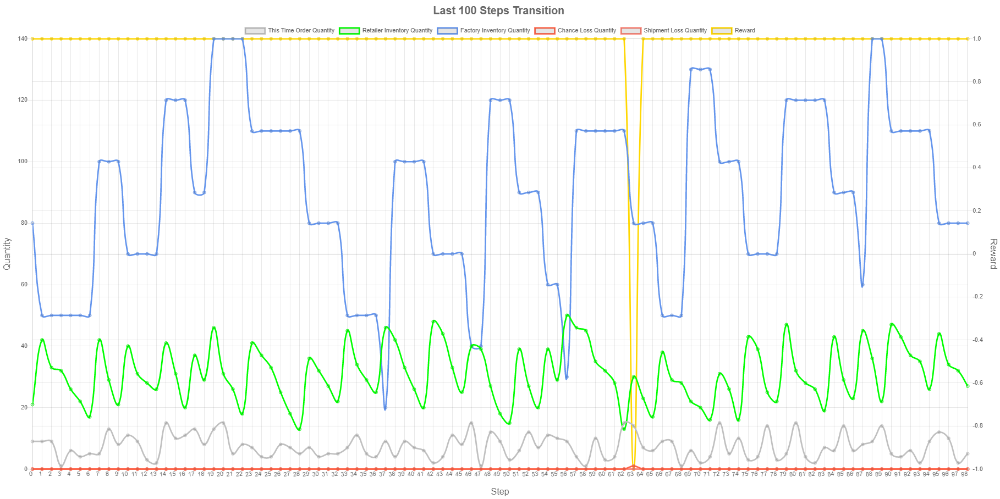
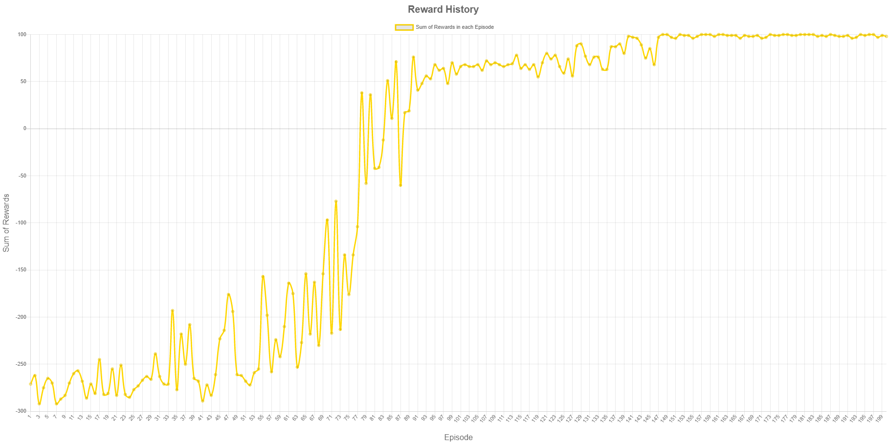
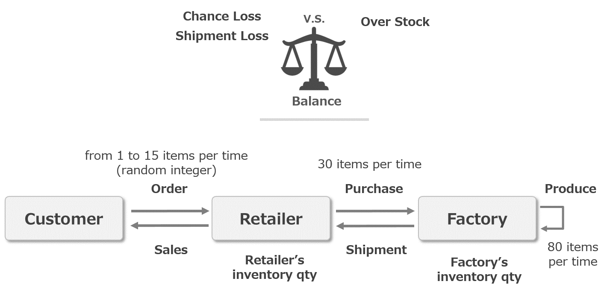

# RL4J Demo (Supply Chain)

This application is a demo application of RL4J (see https://deeplearning4j.org/) for my self-study about reinforcement learning.

A motif of this application is "Beer Distribution Game". (see https://en.wikipedia.org/wiki/Beer_distribution_game).  
"Retailer" and "Factory" manage to balance both supply and inventory not to be getting overstock and chance/ship loss.  




## Prerequisites

This application runs on JVM.
Before you start this application, you need to install the following softwares.

- Java (version 8 or later)

- Apache Maven


## Using Java Libraries

- DL4J (1.0.0-beta7)

- RL4J (1.0.0-beta7)

- Spring Boot

- WebJars (jquery, bootstrap, chartjs, sockjs, stompjs)


## Build and Run


```sh
$ cd demo-rl-supply-chain
$ mvn spring-boot:run
```

or

If you want to make a fat jar file, please execute following commands.

```sh
$ cd demo-rl-supply-chain
$ mvn clean package
$ cd target
$ java -jar demo-rl-application.jar
```

After the spring boot server starts, and then you open your browser (Chrome, Firefox, Edge etc. IE isn't supported)  
and access to http://localhost:8080/ .

Click "Start Training" button, then reinforcement learning will start,  
and its simulation process will be displayed on your browser after a while. (only when live rendering mode is on)

[Note: At the first time build, it will takes long time to build due to gather necessary libraries.]

[Note: If you failed libraries download by Maven, check this blog https://blog.sonatype.com/central-repository-moving-to-https.]

[Caution: This simple demo application works as a web application. But this is just for one-shot demo, so simultaneous access is not supported at all.]


## Screenshots

### Balancing Supply and Inventory


### Transition of Steps


### Reward History


## Reinforcement Learning

### Environment:
This picture shows the characters in this simulation game.



The customer orders X items every step.  
X is a random number between 1 and 15.  
the customer also shows how many items will order at next step.  

The retailer sells items from the retailer's inventory as much as customer orders.  
If retailer's inventory quantity is under customer's order quantity, then a chance loss happens.  
On the other hand, if the retailer purchases too much items in order to avoid chance loss, then it causes overstock.

The factory ship items from the factory's inventory as much as retailer purchases.  
If factory's inventory quantity is under retailer's purchase quantity, then a shipment loss happens.  
On the other hand, if the factory produces too much items in order to avoid shipment loss, then it causes overstock.

A chance/shipment loss and overstock are penalized. Those are related with a reward calculation. (The detail is described later.)  
The retailer and factory manage to balance both supply and inventory not to be getting overstock and chance/ship loss. 


### State Space:

I defined a state space as follows.

The shape of state is [4].

[ this time order qty, next time order qty, retailer's inventory qty, factory's inventory qty ]


### Action Space:

0. **Do nothing:**  
   the retailer and factory do not purchase/produce.
   Just sell/ship from their current remaining inventory.

1. **Only Purchase:**  
   the retailer purchases 30 items per time to the factory.

2. **Only Produce:**  
   the factory produces 80 items per time.

3. **Purchase and Produce:**  
   the retailer and factory purchases/produces as above.


i.e. non-fixed interval and fixed quantity purchase/production system.


### Reward Calculation:

Reward = Base Point + Total Penalty

#### Base Point:

Base Point = 1  
(always 1)

#### Penalty:

Penalties are negative rewards such like following.

- Chance loss = -2
- Shipment loss = -2
- Double Over Stock = -1 ( when retailer's (or factory's) inventory quantity is greater than 60 (or 120). ) 
- Triple Over Stock = -2 ( when retailer's (or factory's) inventory quantity is greater than 90 (or 180). )

#### Reward Example:

If the retailer causes a chance loss and the factory has double over stock,  
then Reward = Base Point + Total Penalty = 1 + (-2 -1) = -2 .

If both retailer and factory cause no chance/shipment loss and have no overstock,  
then Reward = Base Point + Total Penalty = 1 + 0 = 1 .


## License

MIT License

## References

Please refer to the following links.

1. **" Start Reinforcement Learning with RL4J "**

   a presentation document regarding this app.  (in Japanese)  

   https://www.slideshare.net/YukiTagami1/start-deep-reinforcement-learning-with-rl4j-238949339


2. **DL4J**

   Eclipse Deeplearning4j Development Team. Deeplearning4j: Open-source distributed deep learning for the JVM, Apache Software Foundation License 2.0.

   http://deeplearning4j.org

   https://github.com/eclipse/deeplearning4j-examples/tree/master/rl4j-examples


