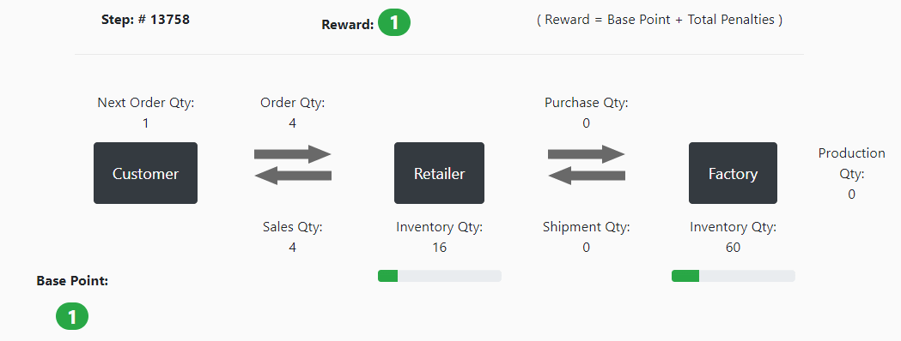
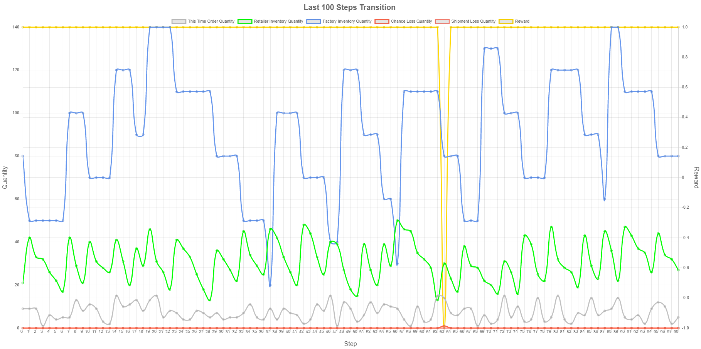
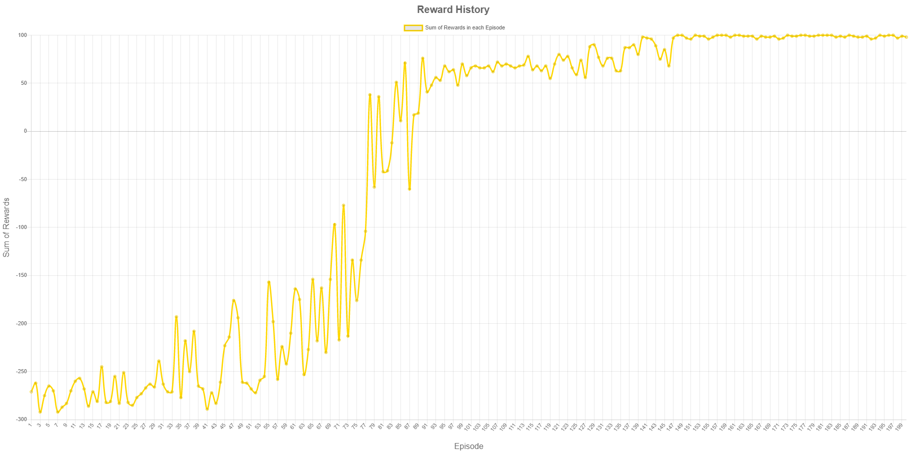
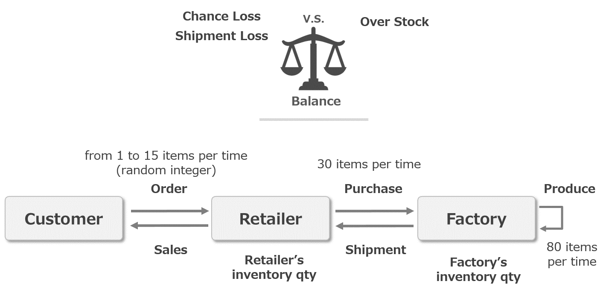

# RL4J Demo for Supply Chain

This application is a demo application of RL4J (see https://deeplearning4j.org/) for my self-study about reinforcement learning.

This application is a motif of "Beer Distribution Game". (see https://en.wikipedia.org/wiki/Beer_distribution_game).  
"Retailer" and "Factory" manage to balance both supply and inventory not to be overstock and chance/ship loss.  




## Prerequisites

This application runs on JVM.
Before you start this application, you need to install the follows softwares.

- Java (version 8 or later)

- Apache Maven


## Using Java Libraries

- DL4J

- RL4J

- Spring Boot

- WebJars (jquery, bootstrap, chartjs, sockjs, stompjs)


## Build and Run


```sh
$ cd demo-rl-supply-chain
$ mvn spring-boot:run
```

or

If you want to make a fat jar file, please execute following commands.

```sh
$ cd demo-rl-supply-chain
$ mvn clean package
$ cd target
$ java -jar demo-application.jar
```

[Caution: At first time build, it will takes long time to build, due to gather necessary libraries.]


After the spring boot server started, you open your browser (Chrome, Firefox, Edge etc. IE isn't supported)  
and access to http://localhost:8080/ .

Click "Start Training" button, then a learning will start,  
and a simulation process will be displayed on your browser after a while. (, when live rendering mode is on)


[Caution: This simple demo application works as a web application. But this is just for demo, so simultaneous access is not supported completely.]


## Screenshots

### Balancing Supply and Inventory


### Transition of Steps


### Reward History


## Reinforcement Learning

### Environment:
This picture shows the characters in this simulation game.



The customer order X items every step.  
X is a random number between 1 and 15.  
the customer also show how many items will order at next step.  

The retailer sells items as much as customer order, from the retailer's inventory.  
if retailer's inventory quantity is under customer's order quantity, then a chance loss happens.  
On the other hand, if the retailer purchases too much items in order to avoid chance loss, then it causes overstock.

The factory ship items as much as retailer purchase, from the factory's inventory.  
if factory's inventory quantity is under retailer's purchase quantity, then a ship loss happens.  
On the other hand, if the factory produces too much items in order to avoid ship loss, then it causes overstock.

A chance/ship loss and overstock are penalized. Those are related with a reward calculation. (The details will be described later.)  
the retailer and the factory manage to balance both supply and inventory not to be overstock and chance/ship loss. 


### State Space:

I defined a state as follows.

The shape of state is [4].

[ this time order qty, next time order qty, retailer's inventory qty, factory's inventory qty ]


### Action Space:

0. **Nothing to do:**  
   the retailer and the factory does not purchase/produce.
   Just sell/ship from their current remaining inventory.

1. **Only Purchase:**  
   the retailer purchase 30 items per time to the factory.

2. **Only Produce:**  
   the factory produces 80 items per time.


3. **Purchase and Produce:**  
   the retailer and the factory purchases/produces as above.


i.e. non-fixed interval and fixed quantity purchase/production system.


### Reward Calculation:

Reward = Base Point + Total Penalty

#### Base Point:

Base Point = 1  
(always 1)

#### Penalty:

Penalties are negative rewards such like following.

- Chance loss = -2
- Ship loss = -2
- Double Over Stock = -1 ( when retailer's (or factory's) inventory quantity is greater than 60 (or 120). ) 
- Triple Over Stock = -2 ( when retailer's (or factory's) inventory quantity is greater than 90 (or 180). )

#### Reward Example:

if the retailer happens a chance loss and factory has double over stock,  
then Reward = Base Point + Total Penalty = 1 -2 -1 = -2 .

if the retailer/factory happens no chance/ship loss and has no over stock,  
then Reward = Base Point + Total Penalty = 1 + 0 = 1 .


## License

MIT License

## References

Please refer to the links below.

1. **" Start Reinforcement Learning with RL4J "**

   a presentation document regarding this app.  (in Japanese)  

   SlideShare  (now in preparation. )


2. **DL4J**

   Eclipse Deeplearning4j Development Team. Deeplearning4j: Open-source distributed deep learning for the JVM, Apache Software Foundation License 2.0.

   http://deeplearning4j.org

   https://github.com/eclipse/deeplearning4j-examples/tree/master/rl4j-examples


